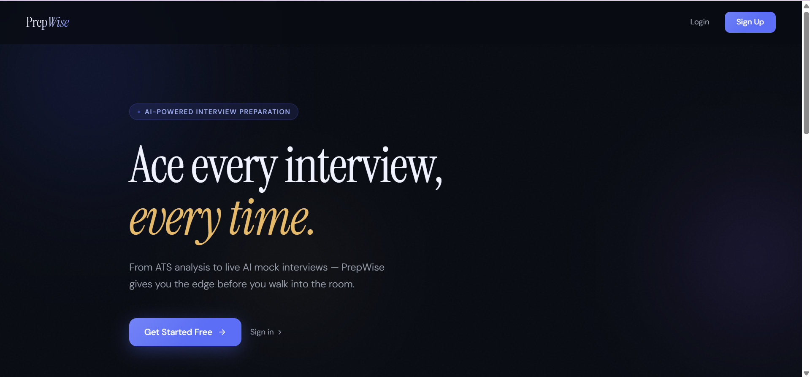
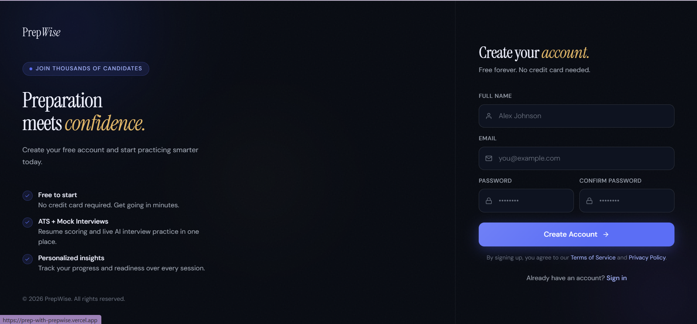
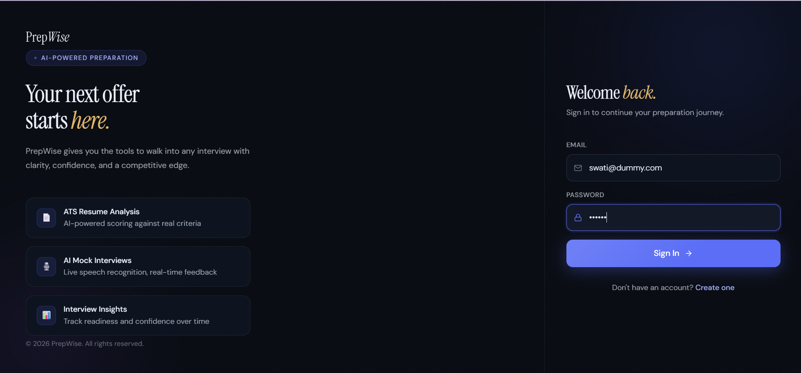
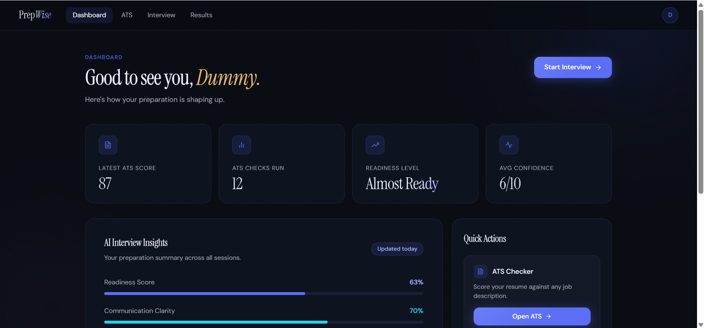
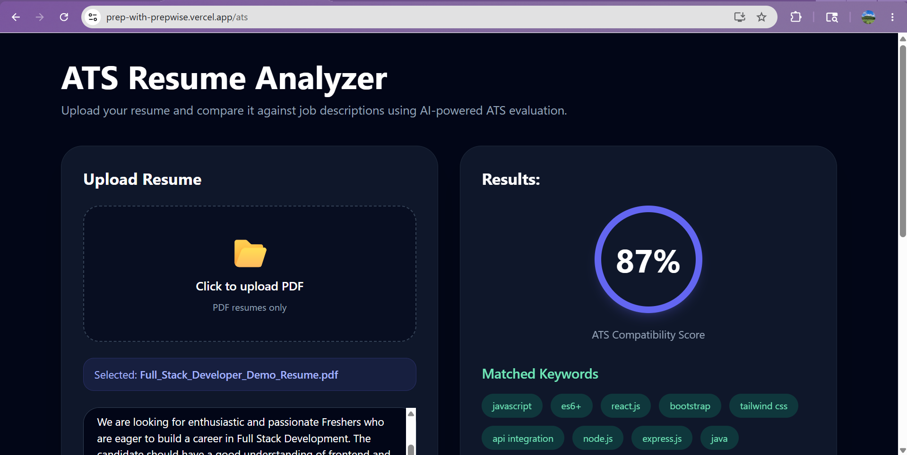
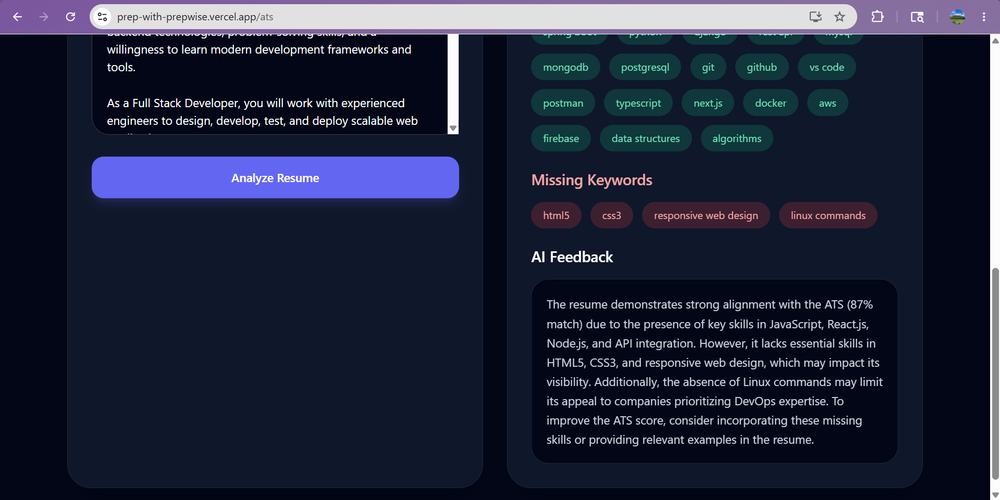
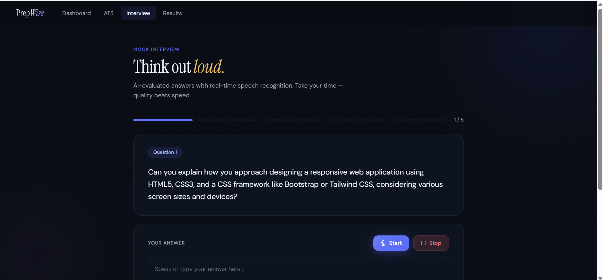
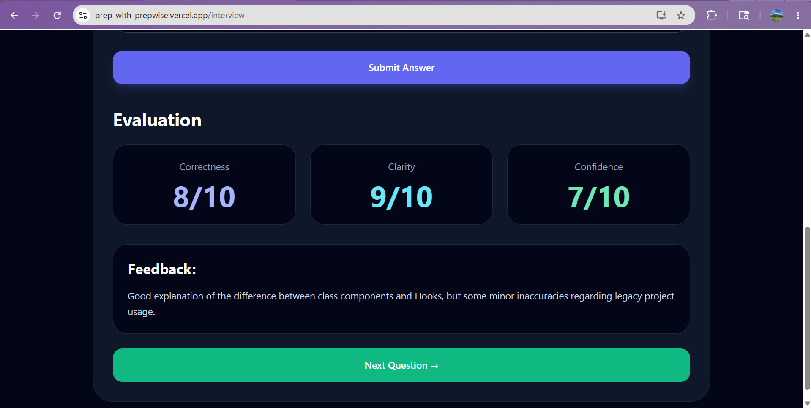
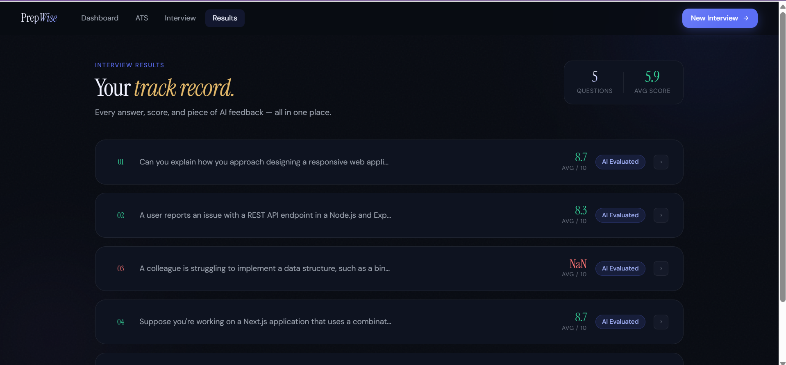
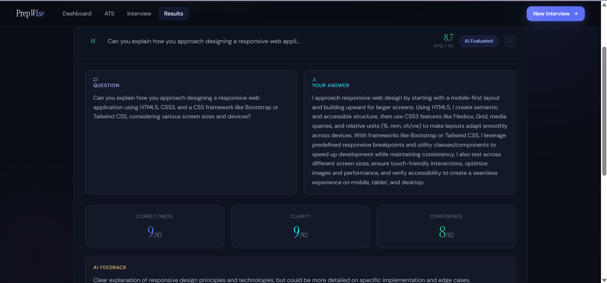

# PrepWise – AI Powered Interview Preparation Platform

PrepWise is a full-stack AI-powered interview preparation platform that helps users improve their resumes and interview performance through ATS analysis, mock interviews, speech-to-text responses, and AI-generated feedback.

Live Demo: https://prep-with-prepwise.vercel.app

---

# Features

## Authentication
- User Signup/Login
- JWT-based authentication
- Protected routes

## ATS Resume Analyzer
- Upload PDF resumes
- AI-powered technical keyword extraction
- Deterministic ATS scoring
- Missing & matched keyword analysis
- Intelligent improvement feedback

## AI Mock Interviews
- AI-generated interview questions
- Speech-to-text answer input
- Real-time transcript generation
- AI evaluation of:
  - Correctness
  - Clarity
  - Confidence

## Interview Results Dashboard
- View previous interview attempts
- Detailed evaluation history
- Feedback analytics

## Modern UI
- Responsive TailwindCSS interface
- Dark AI-themed dashboard
- Interactive cards & analytics UI

---

# Tech Stack

## Frontend
- React.js
- TailwindCSS
- React Router
- React Hot Toast

## Backend
- Node.js
- Express.js
- PostgreSQL
- JWT Authentication

## AI Integration
- Groq API (Llama 3.1)
- Speech Recognition API
- PDF Parsing using pdf-parse

## Deployment
- Frontend: Vercel
- Backend: Render

---

# System Architecture

User → React Frontend → Express Backend → PostgreSQL + Groq AI API

---

# Screenshots











---

# Installation

## Clone Repository

```bash
git clone https://github.com/gitswati-27/AI-powered-Interview-Prep.git
```

## Frontend Setup

```bash
cd intelliprep-frontend
npm install
npm start
```

## Backend Setup

```bash
cd IntelliPrep-backend
npm install
npm run dev
```

---

# Future Improvements (Open for collab!)

- Webcam-based interview analysis
- AI-generated learning roadmap
- Resume redesign suggestions
- Company-specific interview modes
- Leaderboards & progress tracking

---

# Author

Swati  
B.Tech CSE Student | Full Stack & AI Enthusiast
